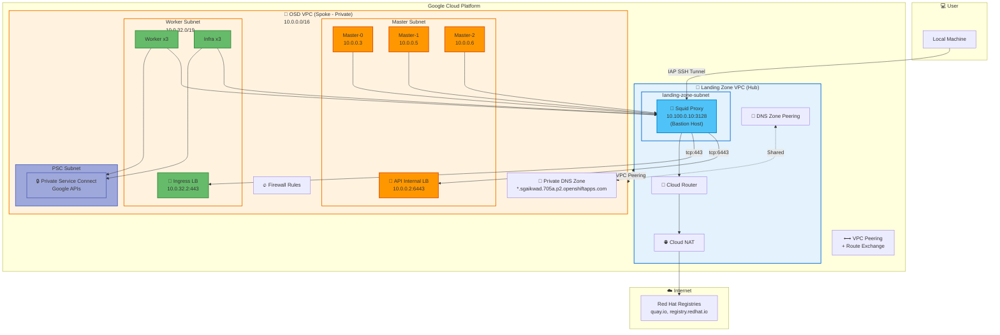

# OSD on GCP - Hub-Spoke Architecture

## Architecture Overview



## Detailed Architecture Diagram

```
┌──────────────────────────────────────────────────────────────────────────────────────────────────────┐
│                                    Google Cloud Platform                                              │
│                                                                                                       │
│  ┌─────────────────────────────────────┐         ┌─────────────────────────────────────────────────┐ │
│  │  🏢 Landing Zone VPC (Hub)          │         │  🎯 OSD VPC (Spoke - Private)                   │ │
│  │     10.100.0.0/24                   │         │     10.0.0.0/16                                 │ │
│  │                                     │         │                                                 │ │
│  │  ┌───────────────────────────────┐  │         │  ┌─────────────────┐  ┌─────────────────────┐  │ │
│  │  │  landing-zone-subnet          │  │         │  │ Master Subnet   │  │ Worker Subnet       │  │ │
│  │  │  10.100.0.0/24                │  │         │  │ 10.0.0.0/19     │  │ 10.0.32.0/19        │  │ │
│  │  │                               │  │         │  │                 │  │                     │  │ │
│  │  │  ┌─────────────────────────┐  │  │   VPC   │  │ ┌─────┐┌─────┐  │  │ ┌──────┐ ┌───────┐  │  │ │
│  │  │  │  🦑 Squid Proxy         │  │  │ Peering │  │ │ M-0 ││ M-1 │  │  │ │ W x3 │ │ I x3  │  │  │ │
│  │  │  │  10.100.0.10:3128       │◄─┼──┼─────────┼──┼─│     ││     │  │  │ │      │ │       │  │  │ │
│  │  │  │  (Bastion Host)         │  │  │    +    │  │ └──┬──┘└──┬──┘  │  │ └──┬───┘ └───┬───┘  │  │ │
│  │  │  └───────────┬─────────────┘  │  │  Route  │  │    │      │     │  │    │         │      │  │ │
│  │  │              │                │  │ Exchange│  │ ┌──┴──┐┌──┴──┐  │  │ ┌──┴─────────┴──┐   │  │ │
│  │  └──────────────┼────────────────┘  │         │  │ │ M-2 ││API  │  │  │ │ Ingress LB    │   │  │ │
│  │                 │                   │◄───────►│  │ │     ││ LB  │  │  │ │ 10.0.32.2:443 │   │  │ │
│  │  ┌──────────────▼────────────────┐  │         │  │ └─────┘│10.0.│  │  │ └───────────────┘   │  │ │
│  │  │  🔀 Cloud Router              │  │         │  │        │0.2  │  │  │                     │  │ │
│  │  │  landing-zone-router          │  │         │  │        │:6443│  │  └─────────────────────┘  │ │
│  │  └──────────────┬────────────────┘  │         │  │        └─────┘  │                           │ │
│  │                 │                   │         │  └─────────────────┘  ┌─────────────────────┐  │ │
│  │  ┌──────────────▼────────────────┐  │         │                       │ PSC Subnet          │  │ │
│  │  │  🌐 Cloud NAT                 │  │         │                       │ 10.0.64.0/29        │  │ │
│  │  │  landing-zone-nat             │  │         │                       │                     │  │ │
│  │  └──────────────┬────────────────┘  │         │                       │ ┌─────────────────┐ │  │ │
│  │                 │                   │         │                       │ │🔒 PSC Endpoint  │ │  │ │
│  │                 ▼                   │         │                       │ │  Google APIs    │ │  │ │
│  │            Internet                 │         │                       │ └─────────────────┘ │  │ │
│  │                                     │         │                       └─────────────────────┘  │ │
│  │  ┌───────────────────────────────┐  │         │                                                 │ │
│  │  │  📡 DNS Zone Peering          │◄─┼─────────┼─────────────────────────────────────────────────┤ │
│  │  │  Resolves *.openshiftapps.com │  │         │  🔐 Private DNS Zone                           │ │
│  │  └───────────────────────────────┘  │         │     *.sgaikwad.705a.p2.openshiftapps.com       │ │
│  │                                     │         │                                                 │ │
│  │  🔥 Firewall Rules:                 │         │  🔥 Firewall Rules:                             │ │
│  │  • tcp:3128 from OSD VPC            │         │  • tcp:6443,443,80,22,icmp from 10.100.0.0/24   │ │
│  │  • tcp:22 from IAP (35.235.240.0/20)│         │  • Internal cluster communication               │ │
│  │  • Egress to Internet               │         │  • Health checks from GCP LB ranges             │ │
│  └─────────────────────────────────────┘         └─────────────────────────────────────────────────┘ │
└──────────────────────────────────────────────────────────────────────────────────────────────────────┘

                    ┌───────────────┐
                    │  💻 User      │
                    │  Laptop       │
                    └───────┬───────┘
                            │
                            │ IAP SSH Tunnel
                            │ (Encrypted)
                            ▼
                    ┌───────────────┐
                    │  Proxy VM     │
                    │  (Bastion)    │
                    └───────┬───────┘
                            │
                    ┌───────┴───────┐
                    │               │
                    ▼               ▼
            ┌───────────────┐ ┌───────────────┐
            │  API Server   │ │  Console      │
            │  :6443        │ │  :443         │
            └───────────────┘ └───────────────┘
```

## Resource Summary

| Component | Name | CIDR / IP | Purpose |
|-----------|------|-----------|---------|
| **Landing Zone VPC** | `landing-zone-vpc` | `10.100.0.0/24` | Hub VPC with NAT for egress |
| **Squid Proxy** | `landing-zone-proxy` | `10.100.0.10:3128` | Egress proxy + Bastion host |
| **Cloud NAT** | `landing-zone-nat` | - | Internet egress for proxy |
| **OSD VPC** | `${cluster}-vpc` | `10.0.0.0/16` | Spoke VPC (private, no NAT) |
| **Master Subnet** | `${cluster}-master-subnet` | `10.0.0.0/19` | Control plane nodes |
| **Worker Subnet** | `${cluster}-worker-subnet` | `10.0.32.0/19` | Worker & Infra nodes |
| **PSC Subnet** | `${cluster}-psc-subnet` | `10.0.64.0/29` | Private Service Connect |
| **API Internal LB** | `${cluster}-*-api-internal` | `10.0.0.2:6443` | Kubernetes API server |
| **Ingress Internal LB** | `k8s-fw-*` | `10.0.32.2:443` | Application ingress |

## Security Features

| Feature | Description |
|---------|-------------|
| **No Public IPs** | All OSD nodes have only private IPs |
| **Private Service Connect** | Google APIs accessed via private endpoint |
| **Proxy Egress** | All internet traffic goes through Squid proxy |
| **VPC Peering** | Private connectivity between Hub and Spoke VPCs |
| **DNS Zone Peering** | Private DNS resolution shared across VPCs |
| **IAP Tunnel** | SSH access via Identity-Aware Proxy |
| **Firewall Rules** | Least privilege access between VPCs |

## Traffic Flows

| Flow | Path |
|------|------|
| **User → API** | Laptop → IAP Tunnel → Proxy → VPC Peering → API LB (10.0.0.2:6443) |
| **User → Console** | Laptop → IAP Tunnel → Proxy → VPC Peering → Ingress LB (10.0.32.2:443) |
| **OSD → Internet** | Worker → VPC Peering → Squid Proxy → Cloud NAT → Internet |
| **OSD → Google APIs** | Worker → PSC Endpoint → Google APIs (private) |

## Deployment Commands

```bash
# 1. Create Hub-Spoke Infrastructure
./scripts/setup-vpc-infrastructure.sh \
  -p <project-id> \
  -r <region> \
  -c <cluster-name>

# 2. Deploy OSD Cluster with Terraform
terraform apply -var-file="configuration/tfvars/terraform.tfvars"

# 3. Configure DNS Peering (after cluster deployment)
./scripts/setup-vpc-infrastructure.sh \
  -p <project-id> \
  -r <region> \
  -c <cluster-name> \
  --configure-dns

# 4. Access Cluster via Proxy/Bastion
gcloud compute ssh landing-zone-proxy \
  --project=<project-id> \
  --zone=<region>-a \
  --tunnel-through-iap
```
